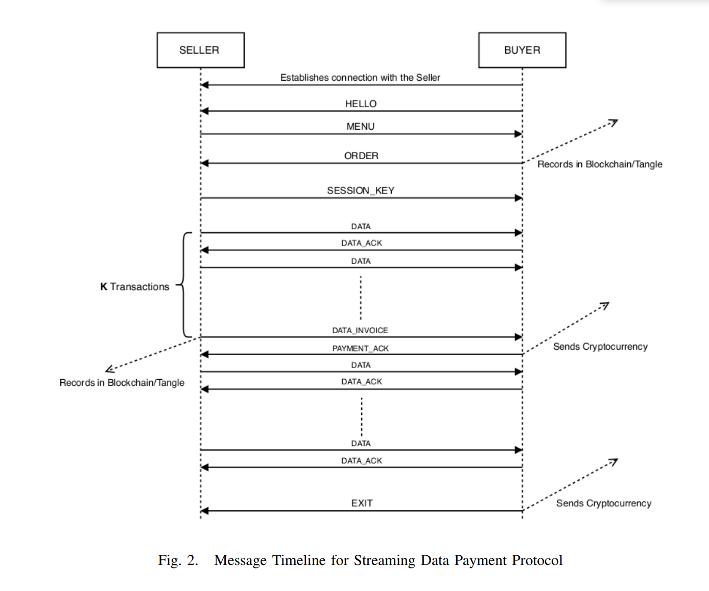
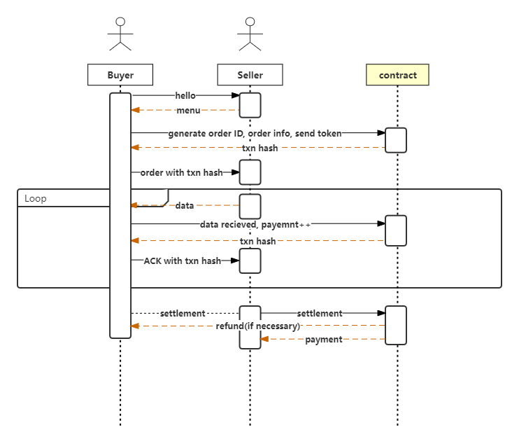
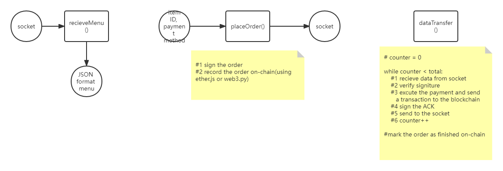
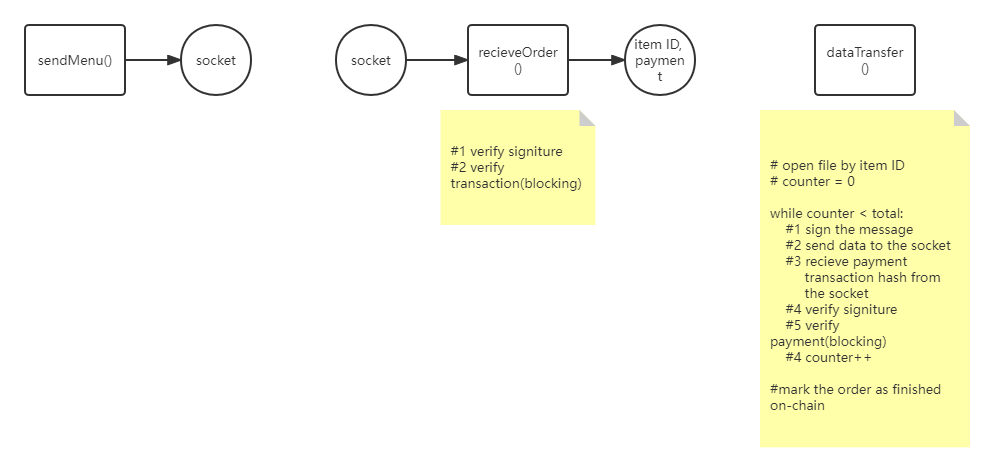
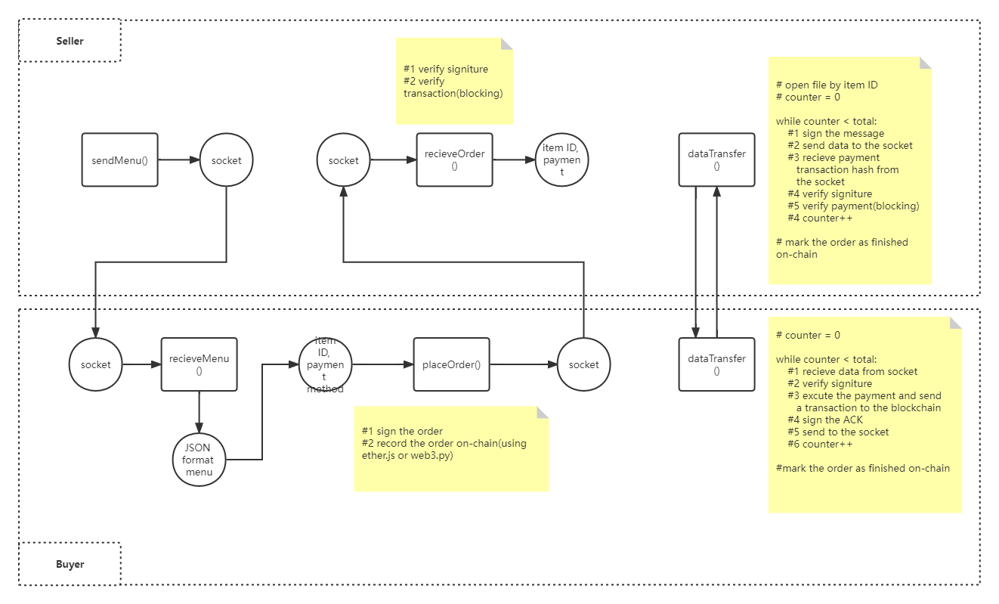

# 交易模块详细设计文档

# 基本业务需求

本文将设计一个支持公平交易的数据传输协议。数据交易由于其特殊性，与传统的网购有很大的区别。第一，数据是可复制的，该特性导致数据交易是不可退款的，即数据交易存在买定离手性。因此，我们的协议设计为分段传输，以此最大化保证交易的公平性，在最坏的情况下，卖家只会损失某一段数据的钱。第二，分段传输则不可避免可能遇到某一方掉线导致交易中断，该协议将支持对某一笔交易进行断点续传。第三，该协议支持强制结算，买卖双方均有权力对某一笔未完成的交易进行结算。

# 研究设计目标

## 基于开源代码实现

[GitHub - ANRGUSC/SDPP: Streaming Data Payment Protocol](https://github.com/ANRGUSC/SDPP)

该repo基于IOTA区块链和python的socket实现了论文（Streaming Data Payment Protocol (SDPP) for the Internet of Things）,该论文以数据分段、消息签名和session key为核心思想构建了一个公平交易的数据传输协议SDPP，流程图如下：



该协议实现了数据的分段传输，但是缺点也很明显：

- 该协议实现为发一段，支付一段，不支持传输结束统一结算，将导致不必要的gas开销。
- 基于IOTA的支付凭证只能支持人工校验，在代码里体现为阻塞等待，效率低；而且，人工校验难免会出错，导致其中一方承受不必要的损失。
- 该协议不支持断点续传，如果在传输过程中某一方出现异常，那么会导致整个交易无从溯源，要想继续只能重新开始，将导致很大的损失。
- 开源实现为python，python在P2P/大量同时连接/具有高速和密集 I/O 的应用程序方面弱于node.js，并且考虑到之后的前端开发，保证开发的全栈特性，我将用node.js实现。

## 安全性

协议基于TLS/SSH进行传输，数据不会被中间人劫持。

#### 消息签名

每一个消息均需要发送人进行签名，接收人收到消息后，通过DSA库计算出发送人的公钥（买卖双方均知道对方公钥），以此进行比对验证消息的合法性，这一点保证了没有人能对不属于自己的订单请求数据。

## 灵活性/高效性

基于EVM的智能合约可以灵活地编码我们的分布式账本，智能合约可以很方便地解决上面提到的统一结算/人工校验/断点续传三个问题。hardhat是目前最为流行的以太坊智能合约开发工具，支持网络环境自定义并提供合约开发部署测试一条龙服务。

## 自动化验证

### 支付凭证自动化验证

该协议支持卖家对买家的支付进行自动化验证。分为两个情况：

1. 创建订单时，卖家需要检查买家的汇款情况，卖家通过合约记录的买家质押的token数量和本地的定价进行对比从而进行校验。
2. 在某一次收到买家的支付凭证后，卖家将对此凭证进行链上校验，流程为：买家收到数据->买家人工验证数据的正确性->将已传输数据量写入链上合约->卖家收到买家的凭证->检查链上记录的已传输数据量与本地记录是否一致->如果一致则继续传输数据，否则中断。

## 断点续传

买家提供order_id，卖家通过检查合约中记录的订单完成情况对数据进行传输。

# 功能及算法设计

# 时序图UML



## 交互步骤

1. 买家通过registry获取卖家信息后，通过信息中的IP:port与卖家建立连接
2. 买家发送hello消息
3. 卖家收到hello，向买家发送menu
4. 买家选定商品后，生成订单ID，记录订单生成时间，deadline，数据规模，双方公钥后，向合约质押充足的代币
5. 买家将链上hash作为凭证发给卖方，卖方验证后按照粒度向买方发送数据
6. 买方收到数据，向合约更新支付信息，获取hash作为凭证发给卖方
7. 卖方验证买方是否付款后继续发送数据，重复步骤5-7
8. 买家或者卖家均有权力终止交易，当其中一方调用合约结算时，合约根据已发送数据/数据总量安比例支付给卖方/退款给买方。
9. 到达deadline后，未完成的订单可以被检测到，执行结算需要发送transaction。

# OrderBook.sol合约

订单簿合约用于记录整个平台的订单状态。合约主要由一个map构成，key为订单的全局唯一ID（该ID由买家和卖家的公钥结合一个salt值生成，如果碰撞，则salt自增，然后重新生成，直到全局唯一为止），value是一个结构体，记录订单信息：

```cpp
class OrderInfo{
    "buyer",                                     // 买家公钥
    "seller",                                    // 卖家公钥
    "total_data",							     // 数据总量
    "data_transfered",                           // 已经传输的数据量
    "is_finished"，							    // 订单是否结束
    “started_from",								 // 订单生成时间
    "deadline"                                   // 截止时间
    ”item_ID“
}
```

## 合约提供6个接口

### create()

```
    function create(OrderInfo calldata info)
        external
        payable
        returns (bytes32 order_id);
```

该接口用于创建订单，买家提供订单信息，合约根据上面提到的方法生成订单ID并记录到map中，并根据买家提供的信息初始化buyer, seller字段。 total_data, start_from字段初始化为区块链的当前时间（调用block.timestamp())，deadline默认为该时间+3days。合约会将买家发送的token数量初始化为cost的值，以供卖方检查。然后将data_transfered，is_finished分别初始化为0，false。

### increase()

```
function increase(bytes32 order_id) external;
```

买家调用该接口为订单进行某一次传输的支付，这个函数会进行两项检查：

- 如果订单已经完成，revert（拒绝）
- 如果调用者不是该订单的buyer，revert
- 否则，增加订单的已传输数据量

### settlement()

```
function settlement(bytes32 order_id) external;
```

该接口提供结算功能，供买卖双方调用。该接口会进行调用者的检查，要求调用者必须为该订单的买家或者卖家。然后，根据已经传输的数据量进行结算/支付，最后标记订单状态为已完成。

### getOrderbook()

只读函数，根据订单ID提供订单info。

### sellerVerifyOrderOnCreated()

```
function sellerVerifyOrderOnCreated(bytes32 order_id, address seller, address buyer, uint256 cost) external view returns(bool);
```

该接口用于seller在收到order的时候对订单的打款情况进行检查。接口接收4个参数，order_id, seller_address, buyer_address和cost，只有当后面的三个参数与合约中记录的值相等的时候，才返回true，否则返回false。

### sellerVerifyOrderOnPayment()

```
function sellerVerifyOrderOnPayment(bytes32 order_id, address seller, address buyer, uint256 cost, uint256 finished) external view returns(bool);
```

该接口用于seller在发送完某一段数据后，对买家是否支付的检查。seller将已经传输的数据量（最后一个参数finished）与合约中的记录进行对比，如果相等，则证明买家已经对其进行了支付，如果不相等，则证明买家没有进行支付。

# Verifier.sol

```
    using ECDSA for bytes32;
    function verifyHash(bytes32 hash, uint8 v, bytes32 r, bytes32 s) public pure
                 returns (address signer) {
        return hash.toEthSignedMessageHash().recover(v, r, s);
    }
```

该合约根据签名hash以及签名的v,r,s值计算消息的签名者地址，ECDSA库的用法https://docs.openzeppelin.com/contracts/2.x/api/cryptography#ECDSA，以及例子https://docs.openzeppelin.com/contracts/2.x/utilities。

# 应用层信息接口

## 通用消息模板

消息模板包括四个部分：消息类型（hello，menu，order，data，ACK，exit），数据载荷（根据不同的消息类型有所不同），签名信息（0x开头的十六进制65字节hash，以太坊签名格式，保证信息的真实性），买家的支付凭证，具体支付的transaction hash（保留，后续平台可能有支持手动校验的需求）

```json
{
    "message_type": "",              // 消息类型
    "payload": "",                   // 数据payload
    "signature": "",                 // 签名
    "verification": ""               // 凭证
}
```

### hello

```json
{
    "message_type": "hello",              
    "payload": {
        "public_key_of_the_buyer"			 // 买家公钥(用于签名验证)
    },                      
    "signature": "",                 
    "verification": ""               
}
```

### menu

```json
{
    "message_type": "menu",
    "payload": {
        "list_of_available_data": [{                 // 所有数据
            "data_ID": "",                           // 商品ID(唯一)
            "data_size": ""							 // 数据大小
            ”data_info": ""						     // 数据描述信息
            ”price“: ""                                // 数据价格
        }],
        "granularity": "",                           // 传输粒度
        "list_of_available_payment": [               // 支付方式
            "alipay",								 // 支付宝
            "token"                                  // 虚拟货币
        ],
    },
    "signature": "signature of the seller",	
    "verification": ""
}
```

### order

```json
{
    "message_type": "order",
    "payload": {
        ”order_hash": ""，                    // 订单哈希，由买家生成并上链
        "data_ID": "",                       // 商品ID
        "payment": "",						 // 支付方式
    },
    "signature": "signature of the buyer",
    "verification": "transaction hash where the buyer has posted the order details" //买家生成链上订单并的凭证
}
```

买家如果选择token的支付方式，还需要额外向合约里打钱，支付宝则不需要。买家将此transaction hash作为凭证发给卖家

### data

```json
{
    "message_type": "data",              
    "payload": "data",                      
    "signature": "signature of the seller",                 
    "verification": ""               
}
```

卖家按照粒度，传输数据并签名。

### ACK

```json
{
    "message_type": "ACK",              
    "payload": "ack",                      
    "signature": "signature of the buyer",                 
    "verification": "transaction hash where the payment has been made"               
}
```

买家收到数据后，将支付信息上链，更新合约状态，将transaction hash作为凭证发给卖方。

### exit

数据传输结束后，双方向对方发送exit消息，附带打分和评价，用于rating上链（TODO）。

```json
{
    "message_type": "exit",              
    "payload": "rating each other",                      
    "signature": "",                 
    "verification": ""               
}
```

### resume

在某一次断联后，买家可以向卖家发送resume消息，payload为断联的order_ID，卖家检查该order是否已经完成，如果尚未完成，继续从合约中记录的断点传输数据。

```
{
    "message_type": "resume",              
    "payload": "order_ID",                      
    "signature": "",                 
    "verification": ""               
}
```


# 模块设计

## Buyer

buyer分为三个模块：



#### Pseudo code：

```python
socket.connet(IP, port)
while true:
    receiveMenu()
    placeOrder()
    dataTransfer()
socket.close()
```

## Seller

seller也分为三个模块：



#### Pseudo code：

```python
server.bind(IP, Port)
while true:
    conn, addr = server.accept()
    sendMenu()
    receiveOrder()
    dataTransfer()
    conn.close()
server.close()
```

## 数据流图



# 异常处理

如果传输过程中某一方掉线，买家可以向卖家提供订单ID信息，卖方链上验证后，继续传输数据，实现断点续传。

如果其中一方永久失联，任意一方均有权力调用结算，合约根据已发送数据/数据总量按比例支付给卖方/退款给买方。


