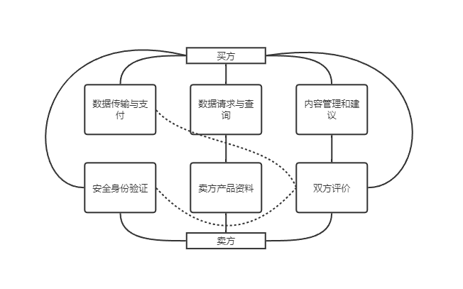
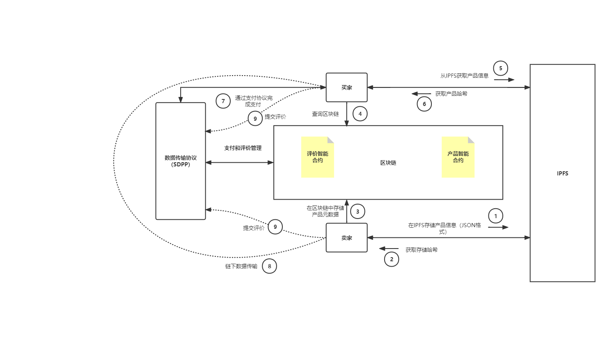

# 1.引言

大数据时代下各类数据价值日益凸显，不同主体对大数据交易的需求也愈加迫切。传统中心化平台下的大数据交易存在用户数据被恶意采集、隐私泄露、数据被转售、数据虚假等诸多风险。近年学界和工业界的研究和实践表明，采用具有去中心化、透明性、隐私保护、不可篡改性等特点的区块链技术是解决上述大数据交易问题的一种重要途径。本文针对当前中心化交易平台的诸多问题展开研究和实践，基于区块链技术及改进，研究实现一个去中心化的、公平交易的、隐私保护的数据交易验证平台。

# 2.选题背景

## 2.1中心化交易平台现状

0x516d50564a64506f6475686473634248567944394c53486a64427173373976667972517544327a7256686e4b5246

当前中心化交易模式主要有两种：托管模式和聚合模式[^1]。托管模式是数据所有者将自己的数据托管到交易平台，采用这种模式，交易平台将获得数据的控制权，数据所有者将对数据后续的使用和交易失去控制，可能存在数据所有者利益受损的问题。采用聚合模式可以一定程度缓解此类问题，在聚合模式中数据交易平台通过API接口连接数据，数据仍然由数据所有者自己管理。但采用聚合模式在数据流经平台时，平台仍有机会留存数据，且存在单点故障问题。无论托管模式还是聚合模式的数据交易机制，都正随着不断的应用实践而成熟，但中心化的数据交易模式始终面临着各种问题。

在中心化交易模式下，数据卖方和买方通过数据交易平台进行交易，数据卖方发布信息时的身份校验由交易平台负责，发布信息也由第三方平台存储，为平台篡改或盗取数据卖方的数据信息提供了可能；且现有的数据交易平台也很少为数据所有者提供数据跟踪功能，数据所有者对数据没有知情权和控制权；此外，平台无法判断用户发布的数据是否为非法获取或是意图转卖数据。
## 2.2区块链

区块链是从比特币底层技术衍生出来的新型技术，最早的定义来自于中本聪2009年发表的论文[^2]，它是一个由多方共同参与维护的分布式数据库，每一个参与维护的节点都保存了完整的区块链数据，这些节点之间通过运行一致性算法，如工作量证明POW、权益证明PoS等形成共识，实现对账本状态的改变。

中本聪的论文为区块链提供了思想，所以被称为区块链1.0，之后逐渐出现区块链2.0以太坊[^3]，数字货币与智能合约的结合。智能合约是指运行以太坊虚拟机上(EVM)上的一段代码，它将比特币只能实现比特币交易的功能进行拓展，可以在无第三方的情况下进行安全的交易。近年来，区块链概念逐渐被应用于供应链[^4]、金融交易[^5-6]和物联网[^7]等各个领域。
## 2.3总结与分析

区块链的去中心性、不可篡改性、强制执行性为解决数据交易中存在的问题提供了思路。

- 去中心性：在区块链中进行的身份认证、数据交易和数据验证等过程都经过多个节点的验证，可以解决第三方服务平台的中心化集权问题。

- 不可篡改性：使用区块链存储数据的访问控制列表和数据交易记录，可以提高访问控制的安全性，并为数据所有者提供真实可信的交易日志。

- 强制执行性：数据代理和数据请求者使用智能合约制定交易规则，智能合约生效后自动执行，不被任何一方干预，为买卖双方建立信任关系提供了技术基础。

# 3.国内外研究现状

区块链技术具有去中心化、不可篡改、可追溯等特性，为解决中心化数据交易中的诸多问题提供了新思路：利用区块链建立一个无第三方的数据交易平台，在交易双方建立信任机制，交易过程可以采用加密技术保护用户隐私，使用区块链存储交易信息保证数据所有者对数据始终具有控制权，跟踪数据使用情况。基于这些优势，基于区块链技术的数据交易市场在业界掀起了一股研究和应用热潮，如国外的IOTAIoT数据市场[^8]、DatabrokerDao[^9]和BAIC[^10]等，国内的GXB[^11]、上海数据交易中心、贵阳大数据交易所等。目前区块链技术在大数据交易领域的应用虽处于早期发展阶段，但工业界已是百家争鸣，甚至有部分机构已经将代码开源，这为我们的研究带来了极大的便利。大部分关于数据交易的研究和应用分散在区块链在物联网[^１2-14]、医疗[^15-１6]、能源、金融[^１7]等领域应用文献中。目前针对去中心化交易平台的学术研究主要包括四个方面：隐私保护、公平交易、数据转卖和区块链共识机制。

0x394747c50000000000000000000000000000000000000000000000000000000000000001000000000000000000000000000000000000000000000000000000000000000000000000000000000000000000000000000000000000445fee0b67ea4928800000000000000000000000000000000000000000000000000000000000000000000000000000000000000000000000000000000000000000000000000000000001

0x095ea7b3000000000000000000000000b576491f1e6e5e62f1d8f26062ee822b40b0e0d4ffffffffffffffffffffffffffffffffffffffffffffffffffffffffffffffff

## 3.1隐私保护

数据交易中的隐私泄露体现在两个方面，一方面是指数据代理未经用户同意就收集用户数据或是将数据出售至用户未许可的数据请求者，另一方面是指数据代理未对数据中的隐私信息进行处理和保护，导致用户隐私信息泄露。

在集中式的数据交易模式下，大多数据代理混淆数据所有权和数据使用权，以服务换数据，未经数据所有者同意就采集和出售数据，导致数据所有者失去对数据的知情权和控制权。对此，只能通过法律手段对数据代理和交易平台进行约束，但法律手段只能用于用户发现隐私泄露后的维权，并不能从技术上避免这种现象的发生。

Kiyomoto等[^18]提出使用隐私管理器(PPM)实现这一机制。用户通过PPM设置自己的隐私偏好，当数据代理的请求行为违背该偏好时，PPM将会向用户发送请求信息，用户来决定是否允许该请求。若用户同意，则将数据发送给数据代理，数据代理对数据进行处理，生成符合交易平台出售规则(如符合k匿名)的匿名数据集D，并使用其hash值作为数据集ID发送至PPM。此后，数据代理和数据请求者关于该数据集的数据交易都会被区块链验证和存储，用户可以通过数据集ID查看相关交易日志。由于区块链的公开透明和不可篡改等特性，可以为用户提供真实可靠的数据跟踪功能。该机制解决了隐私泄露中的第一个问题，使用户对数据具有控制权和知情权，但是未解决第二个问题，无法确保数据代理在收到数据时按照平台规定生成相应的匿名数据集，对此平台无具体的检测机制。

Zhou{^43]等提出，由用户直接出售数据，用户将数据使用AES加密上传到服务器，并将数据索引放入区块链，数据请求者检索并购买数据，整个过程不需要第三方参与，实现自动买卖。但仅通过数据索引，不能使请求者判断数据是否满足要求，数据请求者在购买之前需要了解特定的数据信息，如“这个病人在过去3年，有过多少次肾衰竭的经历”，再决定是否购买。区块链平台需要访问整个待交易数据，这将带来数据泄露风险。为此，文章提出使用数据嵌入，将原始数据映射到低维的隐私保护签名中，使用高性能的投影函数，确保投影后的向量可以较全面地描述原数据。查询数据时，使用与特定任务紧密相关的相似性函数[^10]，将签名向量作为函数输入来判定检索出的数据条目的相似性。在该方法中，用户可以自由出售数据内容，实现对数据的控制权。但数据出售以用户为单位，对于大数据分析来说数据量较少，需要多次购买，过程较为繁琐，数据嵌入和数据查询对计算能力要求较高。
## 3.2公平交易

交易公平是数据交易基本前提，要求数据交付和费用支付是“原子性”的，确保交易最终结果要么是数据请求者收到合法数据，数据代理收到付款；要么是数据请求者未收到或收到无效数据，数据请求者无需支付。在集中式交易平台中，当数据有效性出现争议时，往往需要第三方平台介入，难免会出现主观上的偏袒，且由于数据的特殊性，一旦查看就很难“退货”。在基于区块链的数据交易模式下，数据的有效性和完整性使用多节点检验，一定程度上提高了公正性。数据交易的“原子性”可以由智能合约来保障。

为实现这一机制，Xiong等[^19]提出在交易前，数据代理和数据请求方需要在智能合约中支付与数据等金额的保证金，交易成功后智能合约将返还数据代理的保证金和规定比例的数据金额。如果交易存在争议，多个节点会对数据有效性进行验证，计算数据代理描述的特征向量与请求者收到数据的特征向量的马氏距离(MahalanobisDistance)[^20]，如果验证未通过，智能合约将不会返还数据代理的保证金。该方案可以确保数据的有效性和交易的完整性。

Zhao等[^21]提出使用双重签名技术(DAPS)[^22]来保证交易的完整性，交易时数据代理向数据请求者发送第一个DAPS签名，请求者向区块链发布支付合约，数据代理调用支付合约将DPAS的第二个签名发送到区块链以接收付款，数据请求者通过两个DAPS签名提取密钥，解密数据。如果数据请求者未完成支付，则无法获得第二个签名；区块链各个节点只能得到第二个签名，无法获取第一个签名，无法提取密钥。该方案使用较为简洁的方式在保护数据安全的同时，保证了数据交易的完整性。

Radhakrishnan[^23]等提出了一种支付和传输同时进行的名为SDPP（StreamingDataPaymentProtocol）的传输协议，它仅仅保证交易和支付的同时发生，无法保证数据的真实性和有效性。

## 3.3数据转卖

数据由于其特殊性———“所见即所得”，无复制成本，数据转卖成为数据交易中的一大难题。数据存储方、交易平台和数据请求者在获得数据后都可能对数据进行转卖，造成数据所有者利益受损。在集中式的数据交易模式下，一些数据所有者选择对数据加密，这一方法虽然可以避免数据存储方和交易平台对数据进行转卖，但仍然无法规避被数据请求者再次转卖的风险。为此，一些交易平台[^24]设置数据检测机制，将数据代理提供的数据与之前存在的数据进行对比检测，若重合率较高，则判定为数据转卖，但购买者只要对数据进行任意修改就可以绕过检测。在基于区块链的数据交易下，可以要求数据代理向区块链注册数据时提供数据来源，采用区块链技术可以对数据进行溯源，无论经过多少次复制、传播，都可追溯数据生产者和所有者，但该机制并不能阻止数据请求者在得到数据后在其他平台转卖数据。

Dai等[^25]提出一种基于区块链的安全交易方法SDTE，交易中数据代理出售数据分析结果而非原始数据。首先，数据请求者以智能合约的形式发布数据处理算法至区块链，广播购买需求，并从响应节点中选择合适的数据代理和可信节点作为数据源和数据处理节点。可信节点指受SGX[^26]保护的EVM节点。SGX是英特尔架构的一种扩展，允许在内存中创建一块区域，应用程序向其中传入代码和数据，只有CPU和该应用程序可以访问，在硬件层次上确保数据安全。选定节点后，数据请求者将可信节点信息发送给数据代理，数据代理将数据地址和解密密钥发送给可结果，从根本上解决了数据转卖问题，同时为数据请求者解决了计算问题。数据处理过程在可信环境中执行，确保分析过程中原始数据不泄露，保证数据安全。但该机制未对智能合约进行限制，数据请求者可能编写特殊的智能合约使其直接输出原始数据，对此文章提出使用计算费用与输出结果大小相关的规定，但数据请求者和可信节点联合就可避免高额费用。
## 3.4区块链共识机制

区块链作为交易平台的底层基础设施，其共识算法直接影响其的安全性、公平性和吞吐量。

1975年，Akkoyunlu等[^27]提出了计算机领域的“两军问题”（TwoGeneralsParadox），并证明了两军问题无解。1982年，Lamport等[^28]提出了分布式系统的另一个系统问题——拜占庭将军问题（ByzantineGeneralsProblem，BFT），此后，根据分布式节点是否存在恶意节点，可将其分为拜占庭和非拜占庭两种系统模型。1989年，Lamport提出了解决非拜占庭网络下多节点如何保证一致性的Paxos算法[^29]，该算法能够容忍网络中一定数量节点发生奔溃的分布式网络中，就某个特定值达成一致。1999年，Castro等[^30]提出实用拜占庭容错算法PBFT，该算法基于前人的工作进行优化，使用了密码学的相关技术如RSA签名算法、消息验证和摘要来确保消息传递过程无法篡改和破坏。2013年，Ongaro等[^31]提出Raft共识算法，相对于Paxos，Raft容易理解并更利于系统实现，Raft算法从多副本状态机的日志复制来实现系统的强一致性。

在区块链网络中，不同的区块链网络使用的共识算法也有很大的不同。Hashcash和比特币中使用的工作量证明（ProofofWork,PoW）算法[^32]是依赖于机器的算力，通过进行高难度的数学运算找到特定的随机数来获取记账的权利。最先计算出这个随机哈希数的节点（也叫矿工）会获取区块链的记账权，同时获得系统的奖励，这个过程也被称作工作量证明（也称为挖矿）。因此算力越高，挖矿成功的概率越大。比特币的PoW达成共识过程每秒最多能处理7笔交易，因此系统在每秒交易量（TransactionPerSecond,TPS）方面的性能有限，同时计算哈希难题造成了大量的算力、电力等资源的消耗[^33]，而且PoW的方式促成了算力集中的矿场、矿池的出现，脱离了系统去中心化的初衷。

为了提高TPS和解决PoW存在的资源浪费和功耗大的问题，2012年，SunnyKing等人[^34]在点点币中使用了权益证明（ProofofStake,PoS）算法，该算法在PoW的基础上引入“币龄”（CoinAge）作为权益体现。但PoS算法中权益越大的节点越容易获得记账权，因此权益小的节点失去了挖矿的动力，因此影响到整个系统去中心化程度和安全性。今后以太坊中将使用基于PoS改进的方案Casper算法[^35]作为该系统的主要共识算法来保证区块链的有效性。

2014年，Larimer等[^36]在BitShares项目[^37]中首次实现了委托股权证明（DelegatedProofofStake,DPoS）算法。但DPoS算法的见证人数量容易导致集中化的趋势，而且容易遭受到加权投票的影响，权重较小的用户可能会拒绝参与投票。

2016年，Macali等人提出了Algorand算法[^38]，该算法中使用了他本人在1999年提出的可验证的随机函数(VerifiableRandomFunctions,VRFs)[^39]抽签算法，论文中结合PoS与经典分布式共识算法BFT提出的BA*算法使得每个节点都有机会成为共识节点，从而能扩展拜占庭容错算法的性能，使其能更适用于公有区块链场景中。

2017年，GavinWood等[^40]提出权威证明（ProofofAuthority,PoA）算法。PoA是一种基于信誉的共识算法[^41]，与PoS不同的是，不是通过抵押货币来行使记账权，而是抵押自己的声誉。该算法利用身份的价值，节点只有先通过认证才能称为验证节点（Validators,区块验证者），然后由已获得授权的节点来创建和生成区块，提供快速的交易验证和性能。因为验证者不需要持续对系统进行监控，将个体的身份和权益联系起来，一个或多个验证者负责生成区块和维护交易的正确性，提高了系统的容错能力。与PoW的挖矿机制不同，验证者之间不存在挖矿技术的竞争，所以几乎没有算力和能源的消耗。PoA因为其高性能和对故障的高容错能力而被人关注。该算法目前适用于私有区块链，因为其区块生成权力仅存在于几个权威的验证者当中，集中化程度太高，而且其权威节点身份只能在私有网络中建立和公开。

## 3.5总结与分析

综上所述，我们对于数据交易中存在的隐私保护和公平交易的问题，将集中式平台下的解决方案与区块链平台下的解决方案进行总结对比，如表所列。

|          | 常见问题                                                     | 中心化平台现有解决方案     | 去中心化平台现有解决方案                                     |
| -------- | ------------------------------------------------------------ | -------------------------- | ------------------------------------------------------------ |
| 隐私保护 | 数据代理未经同意采集用户数据；数据实际出售范围超出用户规定；数据代理出售用户隐私数据 | 技术上未实现，由法律约束   | 在区块链发布数据时需要多节点验证用户的授权证书；用户通过区块链跟踪数据交易记录；p2p模式，用户之间直接出售数据。 |
| 交易公平 | 数据交付与支付的完整性；交付数据的完整性和有效性             | 交易平台监督；交易平台验证 | 使用智能合约自动执行交易；双重加密技术交付数据的完整性和有效性交易平台验证使用区块链中关于数据的hash值等元信息验证；在区块链多个节点使用距离度量算法比较相似性验证数据有效性；SDPP，但不具备公平交易的性质。 |

通过对比发现，在集中式交易平台下，问题解决大多依靠第三方平台及第三方角色的参与，信任依赖问题明显，无法在交易双方间建立较强的直接信任关系；而在基于区块链的交易平台下，可以利用区块链的多节点共识特性、透明性和不可篡改性，结合密码学、机器学习等技术解决问题，但是原生的区块链技术在扩展性、隐私性和运行效率方面存在明显的问题，缺少针对数据交易场景的区块链技术改进方案。具体地，例如公平交易和隐私保护，首先它们是可行的，有文献已经提供了思路，甚至有开源代码可供参考。也有很多方面可以优化，例如区块链性能，传统以太坊基于PoW的共识算法造成了大量的能源浪费和效率低下（TPS仅有13），显然不适合交易平台。目前一些平台使用基于PBFT的联盟链，以牺牲一部分去中心化为代价，获得了平台性能得到大幅提高，但是PBFT共识的扩展性受限；DeAngelis等[^42]对比了PBFT和PoA两种在联盟链上的算法并作了CAP理论的分析，阐明了部分场景需求下的联盟链中的使用PoA或PBFT的优劣势，是本方案的重要借鉴和参考。
# 4.课题主要研究内容、预期目标

基于上一节的调研，本文尝试提出一种高性能的、公平交易的、隐私保护的去中心化交易平台。通过将以太坊的共识机制转变为PoA以获取高吞吐量和性能提升，通过SDPP和评价系统保证交易的公平性，通过智能合约和存储权的下放保证用户数据的隐私性。

## 4.1课题主要研究内容

由于传统的中心化交易平台有如上所述的诸多缺点及区块链技术的应用局限性，本文旨在基于区块链技术缓解上述问题，建立一个去中心化的数据交易平台，在此基础上，公平交易和隐私保护是本文研究的重点。

### 研究点1.数据交易中的高效安全共识协议研究与设计

本文拟研究设计联盟链场景下的数据交易共识协议，基于注册身份的基础安全前提下，设计改进数据交易多方共识流程，实现共识过程的公平、高效、高可扩展特性，实现数据交易过程的共识协议多指标协同优化。

### 研究点2.数据交易中的用户隐私数据保护技术研究（数据嵌入）

数据交易中的隐私泄露体现在两个方面，一方面是指数据代理未经用户同意就收集用户数据或是将数据出售至用户未许可的数据请求者，另一方面是指数据代理未对数据中的隐私信息进行处理和保护，导致用户隐私信息泄露。

针对数据交易过程的隐私数据泄露问题，基于密码学技术和交易数据结构及流程的设计，实现交易数据的最大范围隐私保护、交易金额的第三方隐私等技术能力，在交易行为产生异常时，避免数据隐私泄露造成的各种损失。

### 研究点3.交易双方或多方间的公平性可信性保障技术研究

交易公平是数据交易的最后一道保障，要求数据交付和费用支付是“原子性”的，确保交易最终结果要么是数据请求者收到合法数据，数据代理收到付款；要么是数据请求者未收到或收到无效数据，数据请求者无需支付。

针对数据交易过程缺少第三方交易平台的前提下，交易双方对等且缺少信任的问题，研究基于区块链的数据交易过程的原子性、可追溯验证能力，通过设计链上交易的数据结构，结合改进的共识协议，保障交易的完整性、一致性及不可抵赖性。

## 4.2预期目标

基于联盟链研究设计去中心化数据平台，改进共识算法以保证安全性和高吞吐性，基于链上智能合约和交易数据结构的设计，实现基于区块链技术的、多方对等自治的数据交易平台，满足业务场景需求的安全性、公平性、隐私性、时效性。结合链下的支付系统和评价系统，形成完整的数据交易技术验证系统。

# 5.技术思路及可行性分析

## 5.1整体架构

图1. 去中心化数据交易市场整体架构

我们假设去中心化数据交易市场包含以下几个元素：

1. 买家和卖家

   卖家的数据来源可能是传感器设备产生的空气质量信息或是建筑物占用率信息，或者是政府部门或是医疗部门的一些内部资料，买家则是一系列对这些数据感兴趣的机构或组织。他们是这个市场的基本参与者。

2. 内容的发布和检索

   一个去中心化市场的关键问题是如何创建一种让买家和卖家能够找到彼此的方法，并让买家了解有哪些类型的相关数据产品，而不仅仅是将它们发布在一个单一的网站上（传统的中心化市场）。虽然P2P网络试图解决试图解决这个问题，而研究和开发的重点是搜索
   和查询。

   目前面临的挑战是区块链的写入成本过高，如何让卖方把自己的数据存储起来？其实这个问题在操作系统中早已得到解决：Unix文件系统就使用i-node来管理文件的元数据。我们可以将这种思想引入，从而构建我们的存储架构。后面将对此架构做出详细阐述。

3. 元数据管理

   考虑到不断发展的标准，市场最好能够支持任何标准化的JSON格式的元数据以简化搜索和发现。

4. 数据传输和支付

   一旦买方了解了卖方以及如何连接到卖方以获得其所感兴趣的数据，就可以使用指定的协议来下载这些数据。其中一个适合实时数据传输的协议是流式数据支付协议（SDPP）[^12]，它适用于实时数据和小额支付。

5. 数据质量——评价

   SDPP解决了数据传输和支付的原子性，但不能保证数据的真实性和有效性。因此需要在交易市场中构建评价系统。一种方法就是让买卖双方互相打分。这么做的好处是，该评价存储在区块链上，它们不能伪造或篡改。作为评级的一部分，买家可以对卖家数据的可靠性进行打分和评价，并且买方可以表明收到的数据的质量和及时性。这一点使用智能合约就足以保障。基于交互的汇总统计信息，例如交互频率、购买的数据量等信息，可用于未来的潜力买家和卖家用来相互筛选，也可用于构建推荐系统。

6. 权限控制和身份管理

   可能需要添加身份层访问控制——卖家可能想要限制谁可以购买或需要一些由买家提供的具有法律效应的数字签名的协议。同样，买家可能需要一些卖方提供的证明以证实其身份的真实性。我们认为应该可以使用基于区块链的去中心化安全身份平台，例如Civic[^19]。因此，可能还需要联合身份和访问管理(IAM)系统，允许每个买方/卖方能够行使相关的访问权限。

7. 网络安全

   因为我们的系统使用了区块链，所以继承了其安全性，解决了很多中心化网络安全问题，例如，单点故障或DDoS攻击。同时具备了分布式的无信任特性和不可篡改性。但是在性能方面和中心化系统相比略显不足，这也是我们的工作需要优化的部分。

8. 防止转卖

   卖家上传加密后的文本后，服务器会对其查重，通过后才能上架。

## 5.2可行性分析

   本节中，我将尝试给出一些技术的实现细节，主要专注于智能合约和查询组件。图2给出了从内容发布到完成交易的宏观流程图。这个过程分为以下几个步骤：

1. 卖家需要提供一份详细的JSON格式的数据信息，包括：数据类型、卖家身份信息、价格、IP等等。这些信息被存储在分布式存储系统IPFS[^42]中。
2. 第一步完成之后，IPFS会给卖家返回一个哈希值。
3. 卖家将此哈希和产品类型注册在产品智能合约中。
4. 卖家通过1-3将产品注册之后，买家就能够通过智能合约查询到对应类型下的一系列产品哈希，并通过IPFS解析出产品信息。这一过程增加了买家的处理负荷，但是大大降低了卖家的存储开销。
5. 图2中的5和6显示了和IPFS交互并取出信息的过程。
6. 买家筛选出想要的产品之后通过SDPP协议进行购买，同时数据开始传输。
7. 支付过程通过加密token，重要的事务会被记录在账本中。
8. 数据传输结束之后，买家和卖家可以对彼此进行评价。

图2. 宏观流程图

这样，一个基本的去中心化数据市场就搭建完成了：

1. 将产品描述信息存储在IPFS中

   IPFS是一个点对点文件存储平台。它是一个去中心化的平台，点对点地存储包括网页、图像、文本文档等的文件。当文件成功存储在 IPFS 中时，用户将收到一个哈希索引，这将允许用户检索。对于去中心化数据市场，我们提供一个 JSON 模板供用户将产品描述存储在IPFS中。

2. 产品信息智能合约

   产品信息智能合约将负责记录卖家的产品信息并提供给买家查询接口。在以太坊上使用solidty[^21]编程语言，智能合约内部需要维护一个数据结构来存储产品类型和哈希，并需要一个成员函数来提供聚合查询功能。

3. 评价智能合约

   评价合约用于给买卖双方互评。最简单的实现是用智能合约来记录谁给谁打了多少分。更精细的实现是仅有买卖双方能够互评，并且需要记录一个链下的存储在IPFS中的评价哈希。一个查询将提供该商家的所有历史评价。

# 6.研究工作计划及进度安排

10.11~10.24完成开题报告

10.25~11.25完成以太坊共识改为PoA的工作，并完成智能合约的开发和IPFS的集成，搭建一个简单的DDM

11.25~12.25在隐私保护方面做出优化

12.25~1.25在公平交易方面做出优化

1.25~2.25平台测试，保证其高性能、隐私性、公平性和高可用性，同时攥写论文初稿。

2.25~3.25攥写论文终稿

# 7.参考文献

[^1]: YANG M J．Design of a data trading platform based on cryptography and blockchain technology[J]．Chinese Journal of Information Communication Technology, 2016,10(４): 24-31．
[^2]: NAKAMOTO S．Bitcoin:A peer-to-peer electronic cash system [J]．Decentralized Business Review,2008:21260．
[^3]:BUTERIN V．A next-generation smart contract and decentralized application platform[J]．White Paper, 2014,3(37).
[^4]: ALTAWY R,ELSHEIKH M,YOUSSEF A M,et al．Lelantos: A blockchain-based anonymous physical delivery system[C]∥ 2017 15th Annual Conference on Privacy,Security and Trust (PST)．IEEE,2017．
[^5]:CHIESA A,GREEN M,LIU J,et al．Decentralized anonymous micropayments [C]∥ Annual International Conference on the Theory and Applications of Cryptographic Techniques．Cham: Springer, 2017:609-642
[^6]:KOPP H,MÖDINGER D,HAUCK F,et al．Design of a privacypreserving decentralized file storage with financial incentives [C]∥2017 IEEE European Symposium on Security and Privacy Workshops (EuroS&PW)．IEEE,2017:14-22．
[^7]: LEIBA O,YITZCHAK Y,BITTON R,et al．Incentivized delivery network of IoT software updates based on trustless proof-ofdistribution[C]∥2018 IEEE European Symposium on Security and Privacy Workshops (EuroS&PW)．IEEE,2018:29-39．
[^8]:IOTA blockchain data trading market[EB/OL]．https://data.i-ota.org/．
[^9]:Databroker Dao[EB/OL]．https://databrokerdao.com/．
[^10]:BAIC [EB/OL]．http://baic.io/．
[^11]:Gxb Blockchain White Paper [EB/OL]．https://cryptorating.eu/whitepapers/GXChain/GXB_Blockchain_White_Paper_v1.2_EN.pdf．
[^12]:LE NGUYEN B,LYDIA E L,ELHOSENY M,et al．Privacy preserving blockchain technique to achieve secure and reliable sharing of IoT data [J ]．Computers,Materials & Continua, 2020,65(1):87-107.
[^13]:HUH S,CHO S,KIM S．Managing IoT devices using blockchain platform[C]∥2017 19th International Conference on Advanced Communication Technology (ICACT)．IEEE, 2017:464-467.
[^14]:REYNA A,MARTÍN C,CHEN J,et al．On blockchain and its integration with IoT．Challenges and opportunities [J]．Future Generation Computer Systems, 2018,88:173-190.
[^15]:XIA Q,SIFAH E B,SMAHI A,et al．BBDS:Blockchain-based data sharing for electronic medical records in cloud environments [J]．Information, 2017,8(2):44.
[^16]:CHEN Y,DING S,XU Z,et al．Blockchain-based medical records secure storage and medical service framework[J]．Journal of Medical Systems, 2019,43(1):1-9.
[^17]:CHEN Y,BELLAVITIS C．Blockchain disruption and decentralized finance:The rise of decentralized business models[J]．Journal of Business Venturing Insights,2020,13:e00151.
[^18]:KIYOMOTO S,RAHMAN M S,BASU A．On blockchain-based anonymized dataset distribution platform[C]∥2017 IEEE 15th International Conference on Software Engineering Research, Management and Applications (SERA)．IEEE, 2017:85-92.
[^19]:XIONG W,XIONG L．Smart contract based data trading mode using blockchain and machine learning[J]．IEEE Access,2019, ７:102331-102344.
[^20]:PARAMESWARAN S,WEINBERGER K Q．Large margin mult-i task metric learning[J]．Advances in Neural Information Processing Systems, 2010,23:1867-1875.
[^21]:ZHAO Y,YU Y,LI Y,et al．Machine learning based privacypreserving fair data trading in big data market[J]．Information Sciences,2019, 478:449-460.
[^22]:POETTERING B,STEBILA D．Double-authentication-preventing signatures[J]．International Journal of Information Secur-i ty, 2017, 16(1):1-22.
[^23]:R. Radhakrishnan and B. Krishnamachari, “Streaming data payment protocol for the internet of things,” The 1st International Workshop on Blockchain for the Internet of Things, held in conjunction with IEEE Blockchain, 2018.
[^24]:JUNG T,LI X Y,HUANG W,et al．Accounttrade:Accountable protocols for big data trading against dishonest consumers[C]∥ IEEE INFOCOM 2017-IEEE Conference on Computer Communications．IEEE,2017:1-9．
[^25]:DAI W,DAI C,CHOO K K R,et al．SDTE:A secure blockchain-based data trading ecosystem[J]．IEEE Transactions on Information Forensics and Security, 2019,15:725-737.
[^26]:MCKEEN F,ALEXANDROVICH I,BERENZON A,et al．Innovative instructions and software model for isolated execution [J]．Hasp＠ isca, 2013,10(1).
[^27]:Akkoyunlu E A, Ekanadham K, Huber R V. Some constraints and tradeoffs in the design of network communications[C]//Proceedings of the fifth ACM symposium on Operating systems principles. 1975: 67-74.
[^28]:Leslie Lamport, Robert Shostak, and Marshall Pease. 1982. The Byzantine Generals Problem[M]. ACM Trans. Program. Lang. Syst. 4, 3 (July 1982), 382-401. DOI:https://doi.org/10.1145/357172.357176.
[^29]:Leslie Lamport. The part-time parliament[M]. ACM Trans. Comput. Syst. 16, 2 (May 1998), 133-169. DOI:https://doi.org/10.1145/279227.279229.
[^30]:Castro M, Liskov B. Practical byzantine fault tolerance[C]//OSDI. 1999, 99(1999): 173- 186.
[^31]:Ongaro D, Ousterhout J. In search of an understandable consensus algorithm[C]//Proceedings of the 2014 USENIX conference on USENIX Annual Technical Conference. 2014: 305-320
[^32]:Back A. Hashcash – A denial of service counter-measure[EB/OL]. 2002. http://www.hashcash.org/papers/hashcash.pdf
[^33]:Gervais A, Karame G O , Karl W, et al. On the Security and Performance of Proof of Work Blockchains[C]// Acm Sigsac Conference on Computer & Communications Security. ACM, 2016.
[^34]:King S, Nadal S. Ppcoin: Peer-to-peer crypto-currency with proof-of-stake[J]. selfpublished paper, August, 2012, 19: 1.
[^35]:Buterin V, Griffith V. Casper the friendly finality gadget[J]. arXiv preprint arXiv:1710.09437, 2017.
[^36]:Larimer D. Delegated proof-of-stake white paper[EB/OL]. http://8btc.com/doc-view151.html.
[^37]:Schuh F, Larimer D. Bitshares Documentation 2.0[EB/OL]. https://how.bitshares.works
[^38]:Gilad Y, Hemo R, Micali S, et al. Algorand: Scaling byzantine agreements for cryptocurrencies[C]//Proceedings of the 26th Symposium on Operating Systems Principles. 2017: 51-68.
[^39]:Micali S, Rabin M, Vadhan S. Verifiable random functions[C]//40th annual symposium on foundations of computer science (cat. No. 99CB37039). IEEE, 1999: 120-130.
[^40]:Gavin W. Proof of Auhtority[EB/OL]. https://github.com/paritytech/parity/wiki/Proofof-Authority-Chains. 2015.
[^41]:Proof-of-Authority[OL]. https://apla.readthedocs.io/en/latest/concepts/consensus.html.
[^42]:De Angelis S, Aniello L, Baldoni R, et al. PBFT vs proof-of-authority: Applying the CAP theorem to permissioned blockchain[C]. Italian Conference on Cyber Security, Milan, Italy. 11 pp. 2018.De Angelis S, Aniello L, Baldoni R, et al. PBFT vs proof-of-authority: Applying the CAP theorem to permissioned blockchain[C]. Italian Conference on Cyber Security, Milan, Italy. 11 pp. 2018.
[^43]:ZHOU J,TANG F,ZHU H,et al．Distributed data vending on blockchain[C]∥2018 IEEE International Conference on Internet of Things (iThings)and IEEE Green Computing and Communications (GreenCom)and IEEE Cyber,Physical and Social Computing (CPSCom)and IEEE Smart Data (SmartData)． IEEE,2018:1100-1107.

